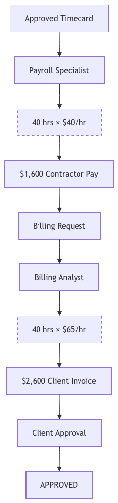
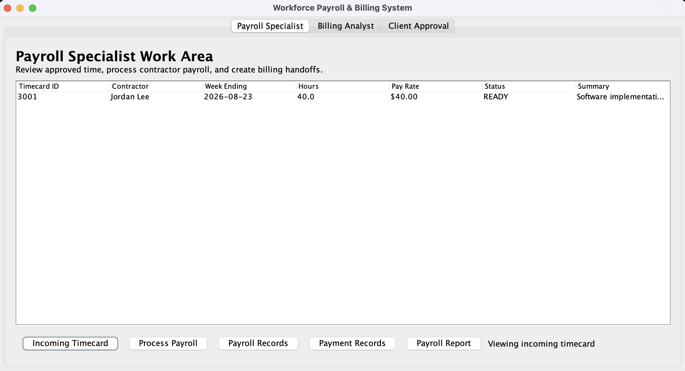
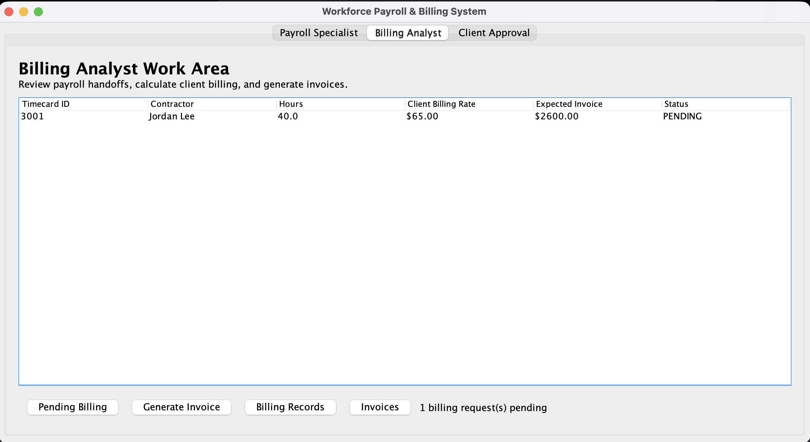
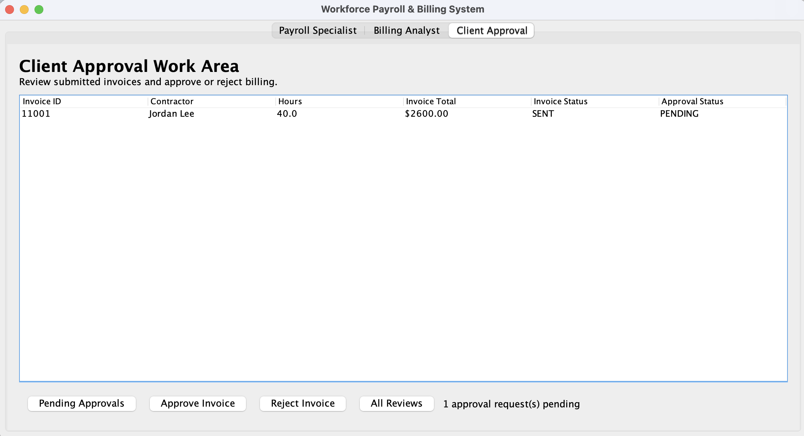
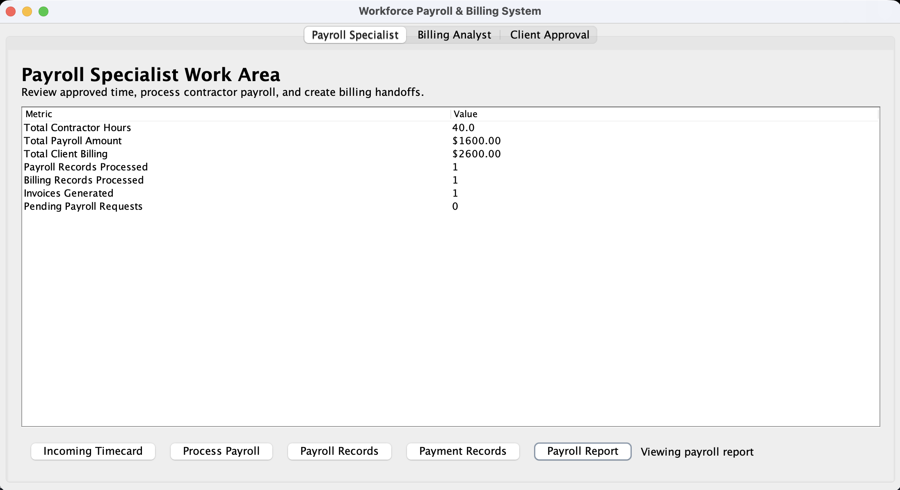

# Workforce Payroll & Billing System

A standalone Java desktop application demonstrating a cross-functional business workflow from approved contractor time through payroll processing, client billing, invoice generation, and approval.

This project focuses on translating a real-world staffing and billing process into structured application workflows while maintaining a clear distinction between **contractor compensation** and **client billing**.

## Workflow



The application moves work between three functional roles:

**Payroll Specialist → Billing Analyst → Client Approval**

An approved timecard begins the process. The Payroll Specialist calculates contractor compensation and creates a billing request. The Billing Analyst uses that request to calculate the amount owed by the client and generates an invoice. The invoice is then routed for client review and approval.

## Core Business Rule

Contractor compensation and client billing are calculated separately using two different rates.

```text
Contractor Pay = Approved Hours × Contractor Pay Rate

Client Billing = Approved Hours × Client Billing Rate
```

For the demonstration data:

```text
40 hours × $40/hour = $1,600 contractor compensation

40 hours × $65/hour = $2,600 client invoice
```

Separating these values allows the system to accurately represent the financial relationship between the worker, staffing operation, and client.

## Application

### Payroll Specialist

The Payroll Specialist reviews approved contractor time, processes payroll, records contractor compensation, and creates the billing handoff for the next functional role.



### Billing Analyst

The Billing Analyst receives the request created during payroll processing and calculates client billing using the contract's separate billing rate.



### Client Approval

After the Billing Analyst generates an invoice, a separate approval request is created for client review.



### Summary Reporting

The application also aggregates activity across the workflow, including contractor hours, payroll totals, client billing totals, processed records, and generated invoices.



## Key Features

* Process approved contractor timecards
* Maintain separate contractor pay and client billing rates
* Calculate contractor compensation
* Create payroll and payment records
* Generate billing requests from completed payroll activity
* Route work between functional roles
* Calculate client invoices
* Generate and track billing and invoice records
* Route invoices for client approval or rejection
* Prevent duplicate payroll and invoice processing
* Validate submitted hours and required contract information
* Track workflow, payment, billing, invoice, and approval statuses
* Generate payroll and billing summary reports

## System Design

The application separates responsibilities across several areas.

### Domain Model

The core model represents the information required by the Payroll and Billing workflow:

* `Contractor`
* `ContractorAssignment`
* `Contract`
* `Timecard`

A contract stores both the contractor pay rate and the client billing rate so each financial workflow can use the appropriate value.

### Workflow Requests

Request objects represent work moving between different functional responsibilities:

* `PayrollRequest`
* `ContractorPaymentRequest`
* `BillingRequest`
* `ClientApprovalRequest`

A lightweight `WorkItem` structure provides common workflow status and tracking behavior without relying on the infrastructure of the original team application.

### Financial Records

The application creates dedicated records for different financial activities:

* `PayrollRecord`
* `PaymentRecord`
* `BillingRecord`
* `Invoice`

Keeping these records separate makes it possible to track contractor compensation independently from amounts billed to clients.

### User Interface

The Java Swing interface provides three role-based work areas:

* `PayrollSpecialistPanel`
* `BillingAnalystPanel`
* `ClientApprovalPanel`

All three views share the same `PayrollBillingModule`, allowing requests and records created by one role to become available to the next role in the workflow.

## Cross-Functional Handoff

One of the main goals of the project was to model work moving between functional areas rather than treating each screen as an isolated component.

```text
Approved Timecard
        ↓
Payroll Specialist
        ↓
PayrollRequest
        ↓
PayrollRecord / PaymentRecord
        ↓
BillingRequest
        ↓
Billing Analyst
        ↓
BillingRecord / Invoice
        ↓
ClientApprovalRequest
        ↓
Client Approval
```

The Billing Analyst works with the request created during Payroll processing, and the Client Approval work area receives the approval request created after invoice generation.

## Automated Testing

The portfolio version includes a JUnit test suite covering six important business and workflow behaviors.

The tests verify that:

* contractor compensation uses the contractor pay rate
* client billing uses the client billing rate
* payroll and billing amounts remain separate
* invoices can move through the client approval workflow
* negative timecard hours are rejected
* summary reporting correctly aggregates payroll and billing activity

Current test result:

```text
Tests run: 6
Failures: 0
Errors: 0
```

## Technologies

* Java
* Java Swing
* Object-Oriented Programming
* `BigDecimal` for monetary calculations
* JUnit 4
* Apache Ant
* Apache NetBeans
* Git and GitHub

The project is currently configured for **JDK 19**.

## Running the Project

### NetBeans

1. Clone or download the repository.
2. Open the project in Apache NetBeans.
3. Confirm that a compatible JDK is configured.
4. Clean and build the project.
5. Run:

```text
app.PortfolioApp
```

The application will open with three tabs:

```text
Payroll Specialist | Billing Analyst | Client Approval
```

To demonstrate the complete workflow:

1. Open **Payroll Specialist** and process the approved timecard.
2. Open **Billing Analyst**, select the newly created billing request, and generate the invoice.
3. Open **Client Approval**, select the invoice, and approve or reject it.
4. Return to the Payroll Specialist report to view the combined payroll and billing results.

A separate console demonstration is also available through:

```text
app.Main
```

## Project Structure

```text
workforce-payroll-billing-system/
│
├── src/
│   ├── app/
│   │   ├── Main.java
│   │   └── PortfolioApp.java
│   │
│   ├── model/
│   │   ├── Contract.java
│   │   ├── Contractor.java
│   │   ├── ContractorAssignment.java
│   │   └── Timecard.java
│   │
│   ├── payrollbilling/
│   │   ├── enums/
│   │   ├── record/
│   │   ├── report/
│   │   ├── request/
│   │   └── PayrollBillingModule.java
│   │
│   ├── ui/
│   │   ├── BillingAnalystPanel.java
│   │   ├── ClientApprovalPanel.java
│   │   └── PayrollSpecialistPanel.java
│   │
│   └── workflow/
│       ├── WorkItem.java
│       └── WorkStatus.java
│
├── test/
│   └── portfolio/
│       └── WorkflowTest.java
│
├── docs/
│   ├── diagrams/
│   │   └── workflow.png
│   └── screenshots/
│       ├── payroll-specialist.png
│       ├── billing-analyst.png
│       ├── client-approval.png
│       └── summary-report.png
│
└── README.md
```

## My Contribution

My work on the original project focused on the Payroll and Billing portion of a larger workforce staffing application.

I designed and implemented the Payroll/Billing domain model, including payroll, payment, billing, and invoice records; workflow requests; status tracking; reporting functionality; and the Payroll Specialist and Billing Analyst work areas.

I also worked on the movement of information between functional areas, including the transition from payroll processing into the billing workflow.

During final testing, I refined the system to maintain a clear distinction between contractor compensation and client billing and improved the handling of contractor assignments during payroll processing.

For this portfolio version, I separated my Payroll/Billing work from the original team architecture and independently created the supporting model, workflow infrastructure, client approval functionality, simplified Swing interface integration, automated tests, documentation, and demonstration data required for the application to run as a standalone project.

## Original Project Context

The original project was developed as a team application modeling a workforce staffing network with multiple functional areas.

My portion focused specifically on Payroll and Billing and the workflows connecting those responsibilities with other parts of the system.

The portfolio version intentionally narrows the application to that business process so the workflow and underlying business rules can be understood independently.

## Coursework Disclosure

This repository is a portfolio adaptation of original coursework completed for **INFO 5100: Application Engineering & Development at Northeastern University**.

The original course project was developed collaboratively as a team. This repository contains my original Payroll/Billing contributions along with supporting code and documentation independently created for this standalone portfolio version.

Instructor-provided assignment instructions, starter or skeleton code, solution code, grading feedback, course-only materials, and teammates' source code are not included.

## What I Learned

This project strengthened my understanding of how business requirements translate into application structure and how information needs to move between different functional roles.

A major challenge was preserving relationships between time, assignments, payroll, billing, and invoices while ensuring that each role operated on the correct records and rates. Building the standalone version also required separating domain-specific functionality from shared infrastructure and replacing those dependencies with a smaller architecture designed specifically around the Payroll and Billing workflow.

The project reinforced the importance of testing complete business processes across functional boundaries rather than evaluating individual screens or classes in isolation.

